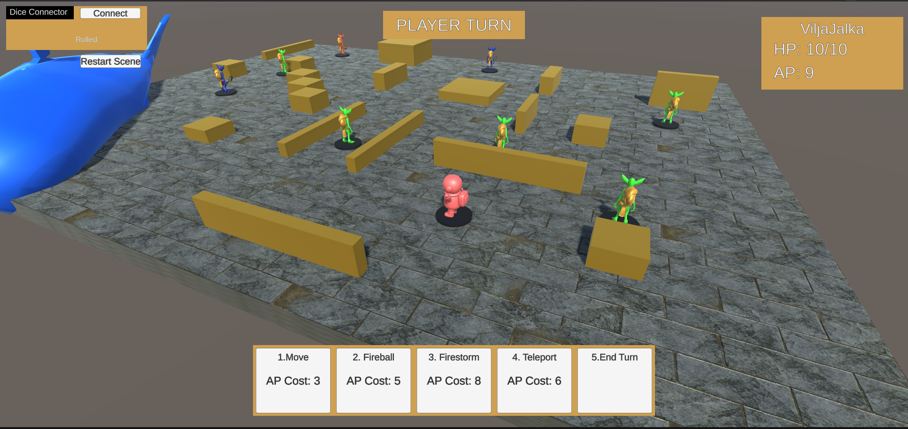
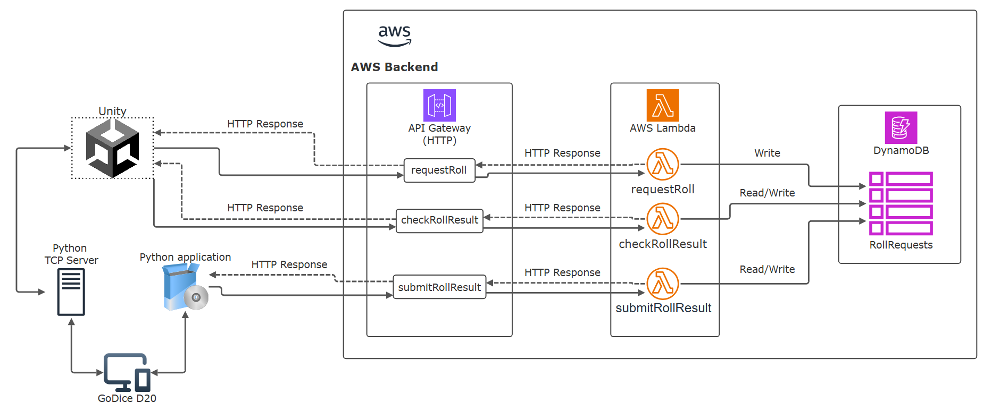

# DiceRollers
A Unity-based 2D RPG board game featuring a GoDice D20 Bluetooth dice integration that works both locally (via TCP) and online (via AWS cloud).
Built to test integrating GoDice to video game experience and use it in-game logic/events. Game systems built with modularity, scalability, data-driveness and editor-friendliness in mind.

Figure: Screenshot from the Unity project.

## 🕹️ Overview

This project was designed to explore how to integrate physical game element (Bluetooth die) to a digital game world and test how effective and reliable the integration was.
Other goal was to test how the physical element affect the video game experience.

When players roll a connected dice, the roll result can be captured locally or through AWS, depending on the setup:
- Local mode: Game connects directly to a local Python TCP server and the server passes roll values to game.
- Online mode: Roll results are sent to AWS via a Python app, stored in DynamoDB, and retrieved by Unity using HTTP polling (UnityWebRequest).

## 🧱 Architecture Overview

Figure: Data flow between Unity, AWS, and the Bluetooth dice via a Python bridge.

### Local TCP Mode (If dice connected locally)

1. Unity starts a local Python TCP server at runtime (executable).
2. Player sends message to server to connect the nearest GoDice.
3. The server listens for dice state updates from the connected GoDice device.
4. Roll results are streamed to the game instantly whenever the dice state changes, allowing near-zero latency play.

### Cloud AWS Mode (If no dice connected locally)
1. Unity uses AWS API Gateway (HTTP) to access Lambda endpoints:
- requestRoll – creates a roll request entry in DynamoDB (primary key = playerID)

2. Python app connects to Bluetooth dice and sends results to AWS tagged with the player’s ID.
- submitRollResult – used by the Python app to submit the roll outcome

3. Unity polls for while until it receives the final roll value, then applies it in-game.
- checkRollResult – polled by Unity to check if a result is available

Unity starts polling for result right after request creating was successful. Players have x-amount of time to send the rollValue via Python App before polling timer runs out.
If Unity doesn't receive the result in time in either mode; it will randomly generate number between 1-20 and use that as roll result for game logic.

For more details on how the Python TCP server & app work, check their own [repository](https://github.com/Pyromaanisorsa/DiceRollerPython).

## 🧾 License

This project is licensed under the **Creative Commons Attribution–NonCommercial 4.0 International License (CC BY-NC 4.0)**.

You may use and modify this project freely for **personal, educational, or research purposes**, provided that you give credit to the author.  
**Commercial use is strictly prohibited.**

### GoDice Python API Notice
This project includes an executable that uses the **GoDicePythonAPI** by **ParticulaCode.**  
The GoDice API is proprietary and licensed for **personal, academic, and non-commercial use only** under its own license terms.  
See the GoDice API License Agreement for details.
